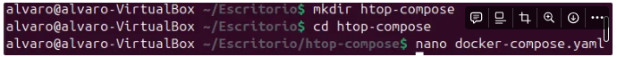
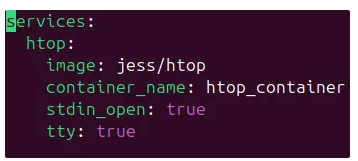
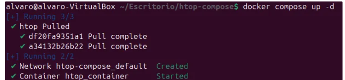
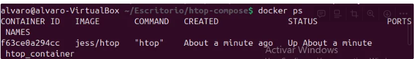
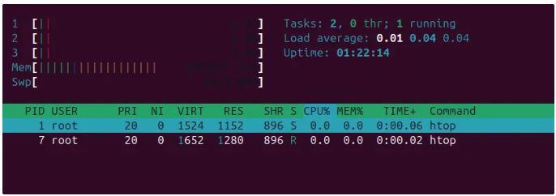
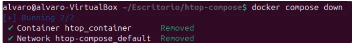

# 🐳 E4 - Docker Compose

[TOC]

# Introducción

**Docker Compose** es una herramienta que permite definir y ejecutar múltiples contenedores Docker usando un archivo YAML. En este ejercicio, desplegaremos la aplicación `htop`, que es un monitor interactivo de procesos para sistemas Unix.

------

## Crear el archivo `docker-compose.yaml`

Docker Compose usa un archivo `docker-compose.yaml` para definir los servicios. Creamos un directorio y dentro de él el archivo:

```bash
$mkdir htop-compose
$cd htop-compose
$nano docker-compose.yaml
```



Y añadimos lo siguiente en el archivo recién creado:

```yaml
services:
  htop:
    image: jess/htop
    container_name: htop_container
    stdin_open: true
    tty: true
```

📌 **Explicación:**

- `services:` → Define los contenedores que se ejecutarán.

- `htop:` → Nombre del servicio.

- `image: jess/htop` → Usa la imagen oficial de `htop`.

- `container_name: htop_container` → Nombre del contenedor.

- `stdin_open: true` y `tty: true` → Permiten interacción en la terminal.

  

------

## Desplegar el contenedor con Docker Compose

Desde la misma carpeta donde se encuentra el archivo `docker-compose.yaml`, ejecuta:

```bash
$docker compose up -d
```

Esto iniciará el contenedor en segundo plano.



Para verificar que está en ejecución:

```bash
$docker ps
```



------

## Acceder a htop

Ejecutamos el siguiente comando para abrir `htop`:

```bash
$docker exec -it htop_container htop
```

📌 **Explicación:**

- `docker exec -it htop_container htop` → Permite interactuar con la aplicación dentro del contenedor.

  

------

## Detener y eliminar el contenedor

Para detener la ejecución de `htop`:

```bash
$docker compose down
```



------

## 🔎 Explicación breve de `htop`

`htop` es una herramienta interactiva de monitorización del sistema similar a `top`, pero con una interfaz más amigable que permite:

- Ver el uso de CPU y memoria en tiempo real.
- Filtrar y gestionar procesos de manera interactiva.
- Matar procesos directamente desde la interfaz.