# 🛠 E2 - Servidor de Base de Datos con Docker Desktop (Interfaz Gráfica)

📌 **Introducción**

Este ejercicio consiste en desplegar un servidor de base de datos utilizando **Docker Desktop**, trabajando con la imagen oficial de **MariaDB**. Se crearán contenedores, se gestionarán volúmenes persistentes y se realizará la conexión con una herramienta gráfica.

---

**Paso 1: Descargar la imagen de MariaDB**

1. Abre **Docker Desktop**.
   
    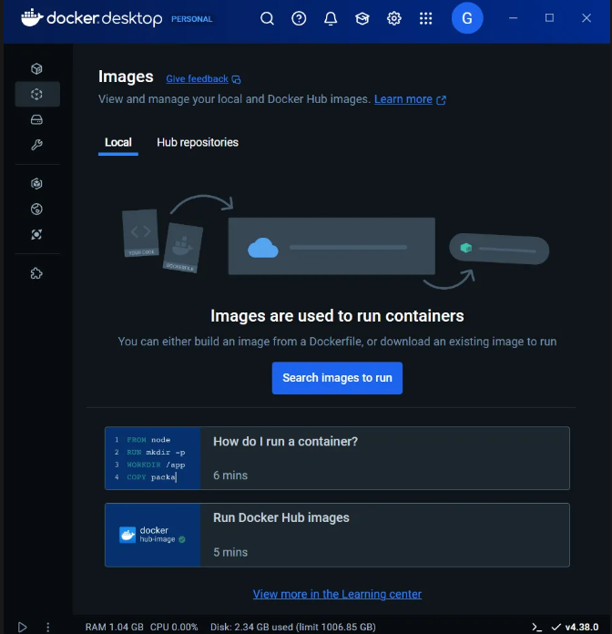

2. Ve a la pestaña **"Images"**.
   
    

3. En la parte superior derecha, haz clic en **"Buscar imágenes"**.
   
    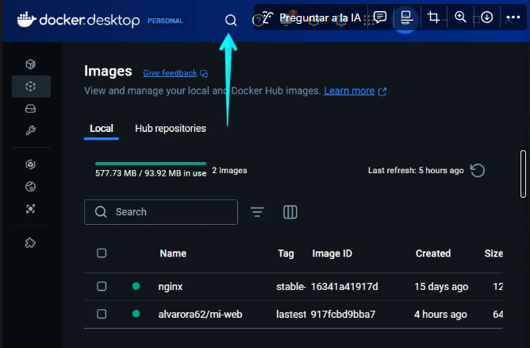

4. Escribe `mariadb` y selecciona la opción oficial.
   
    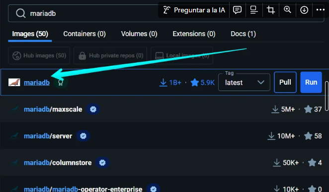

5. Haz clic en **"Pull"** para descargar la imagen.
   
    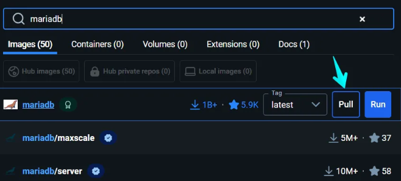

---

**Paso 2: Crear y ejecutar el contenedor**

1. En **Docker Desktop**, ve a la pestaña **"Images"** y haz clic en **"Run"**.
   
    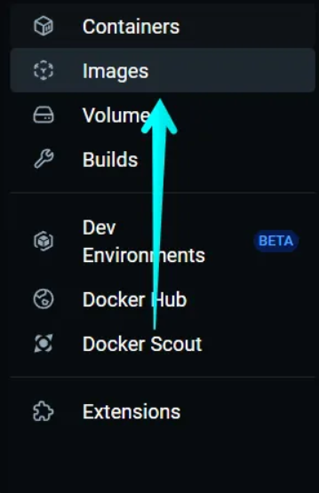

2. Configura los siguientes parámetros:
   
   - **Image**: `mariadb`
   
   - **Container Name**: `bbdd`
   
   - **Ports**:
     
     - Public Port: `3306`
     - Container Port: `3306`
   
   - **Volumes**:
     
     - Añadir un volumen **"datos-mariadb"** y asignarlo a `/var/lib/mysql`.
   
   - **Environment Variables**:
     
     - `MYSQL_ROOT_PASSWORD` - `root`
     
     - `MYSQL_DATABASE` - `base`
     
     - `MYSQL_USER`  - `daw`
     
     - `MYSQL_PASSWORD`  - `daw`
       
       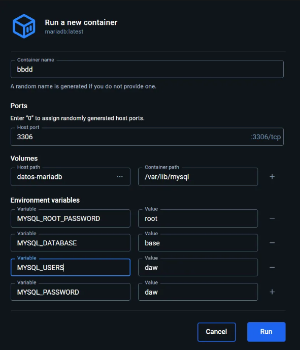

3. Haz clic en **"Run"** para iniciar el contenedor.
   
    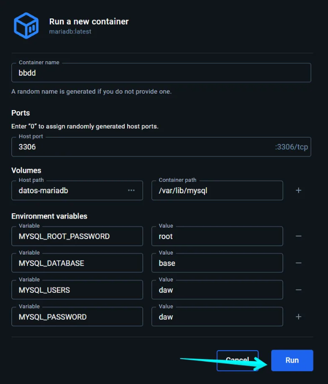

---

**Paso 3: Conexión a la base de datos**

Para verificar que el servidor de base de datos está funcionando correctamente:

1. Abre **DBeaver** u otra herramienta de conexión.
   
    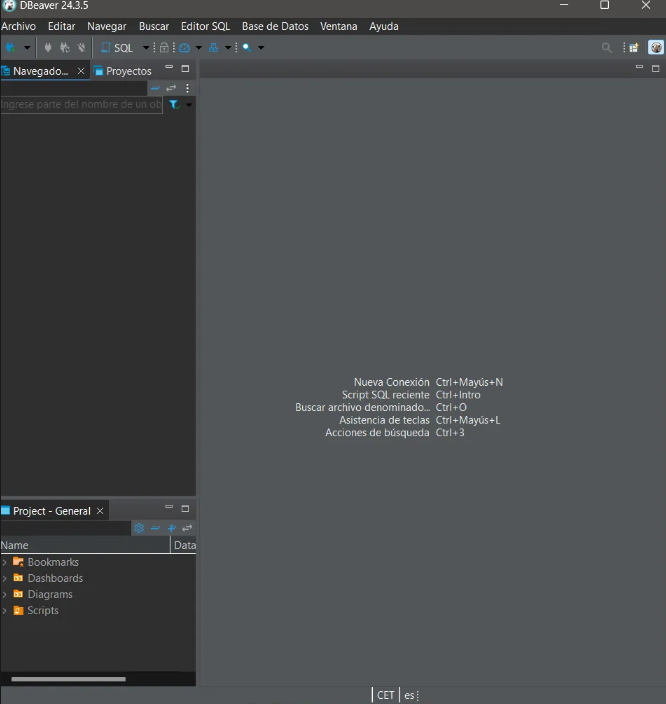

2. Configura la conexión con los siguientes datos:
   
   - **Host**: `localhost`
   
   - **Puerto**: `3306`
   
   - **Usuario**: `daw`
   
   - **Contraseña**: `daw`
   
   - **Base de datos**: `base`
     
     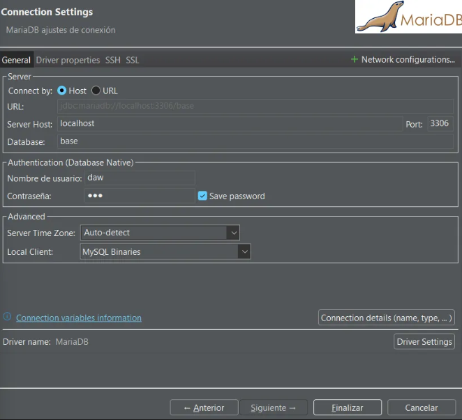

3. Guarda la configuración y prueba la conexión.

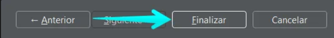

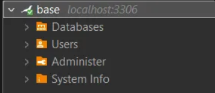

**Crear una base de datos y una tabla**

Ejecuta en la interfaz de DBeaver:

```sql
CREATE TABLE alumnos (
    id INT AUTO_INCREMENT PRIMARY KEY,
    nombre VARCHAR(100),
    edad INT
);
```

- Salida de código:
  
    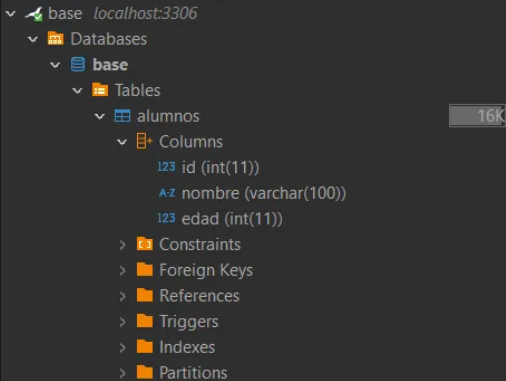

---

**Paso 4: Detener y eliminar el contenedor**

1. Ve a **Docker Desktop** → **Containers**.
   
    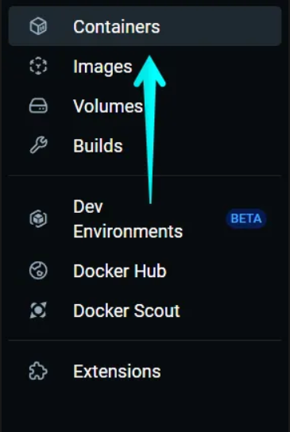

2. Busca el contenedor `bbdd`.
   
   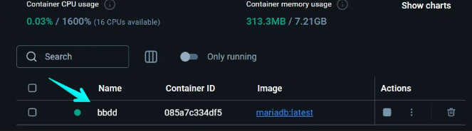

3. Haz clic en **"Stop"** para detenerlo.
   
   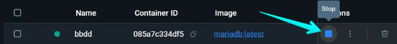

4. Luego, haz clic en **"Delete"** para eliminarlo.
   
   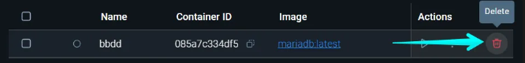

---

1. Verifica que el volumen **"datos-mariadb"** sigue existiendo en la pestaña **Volumes**.

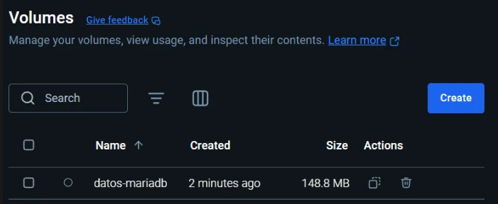

---

**Paso 5: Crear un nuevo contenedor reutilizando los datos**

Ahora, creamos un nuevo contenedor `bbdd-2`, reutilizando el volumen **"datos-mariadb"**:

1. Repite los pasos del **Paso 2**, pero cambia el nombre del contenedor a **`bbdd-2`**.
   
    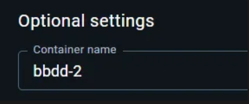

2. Asigna el volumen **"datos-mariadb"** nuevamente a `/var/lib/mysql`.
   
   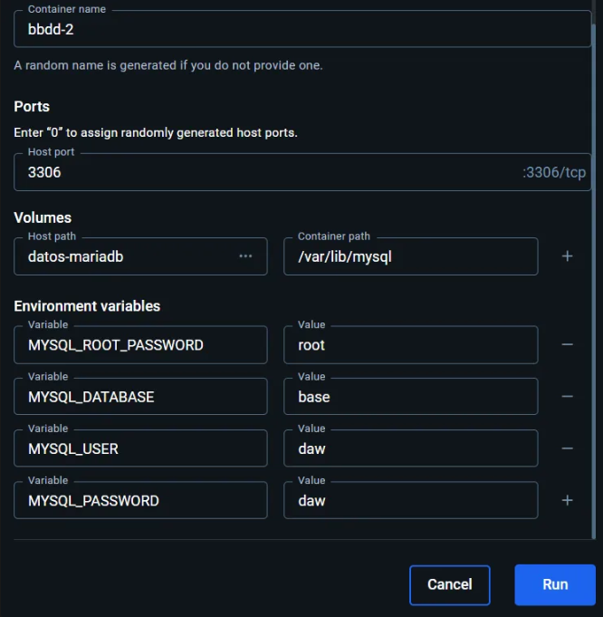

3. Inicia el contenedor y verifica en **DBeaver** si la base de datos y la tabla siguen existiendo.

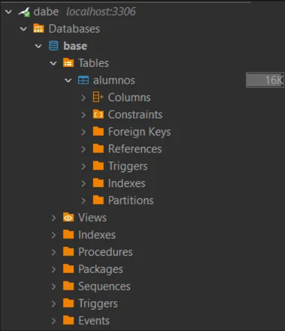

---

**Paso 6: Intentar borrar la imagen de MariaDB**

1. En **Docker Desktop**, ve a la pestaña **Images**.
   
    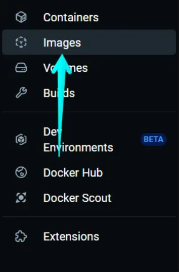

2. Intenta eliminar la imagen `mariadb`.
   
   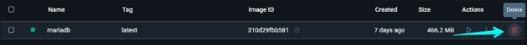

3. Se generará un error indicando que hay contenedores en uso.
   
   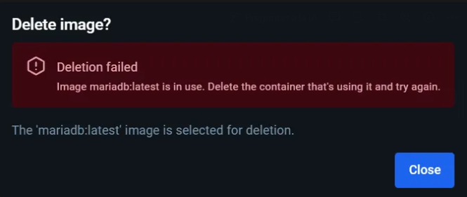

---

**Paso 7: Eliminar todo**

1. **Detener y eliminar el contenedor `bbdd-2`**:
   
   - Ve a **Containers** → Selecciona `bbdd-2`.
     
       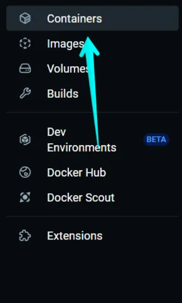
   
   - Haz clic en **"Stop"** y luego en **"Delete"**.
     
     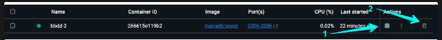

2. **Eliminar el volumen**:
   
   - Ve a la pestaña **Volumes**.
     
       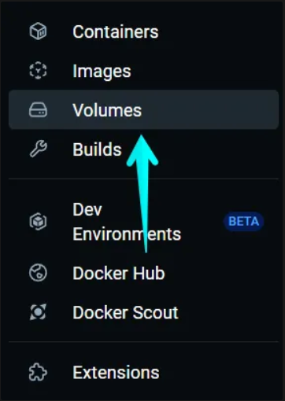
   
   - Busca **"datos-mariadb"** y elimínalo.
     
     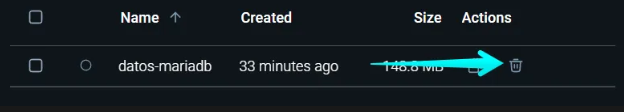

3. **Eliminar la imagen de MariaDB**:
   
   - Ve a la pestaña **Images**.
     
       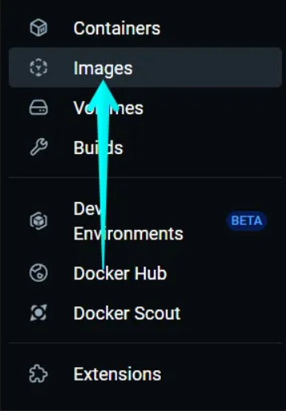
   
   - Selecciona `mariadb` y haz clic en **"Delete"**.
     
     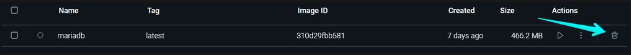

---