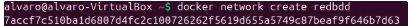
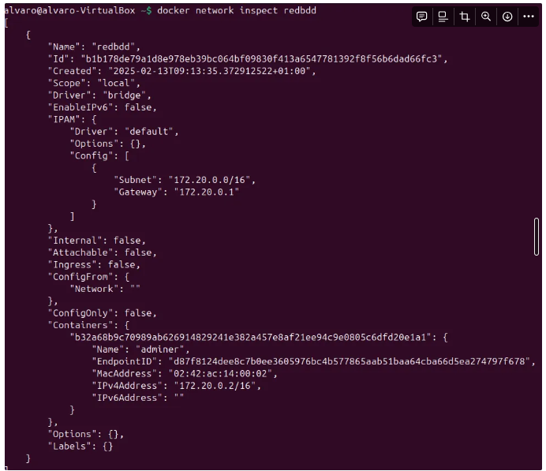
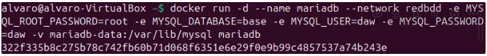
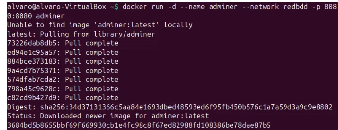
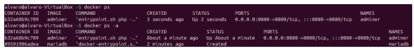
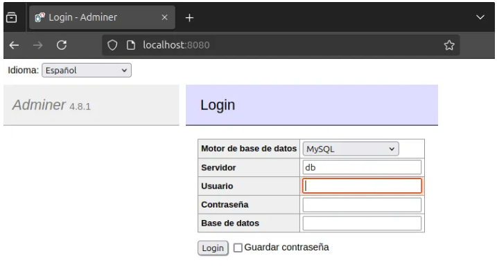
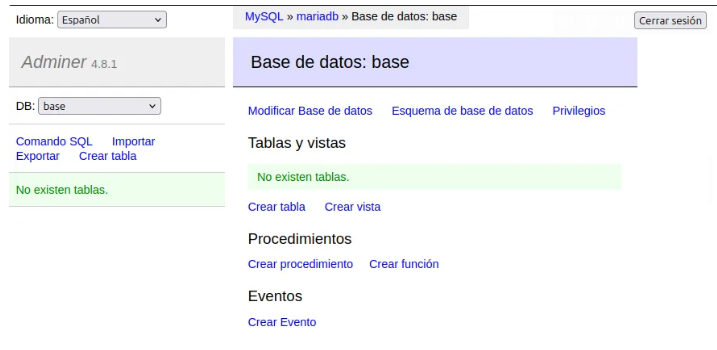
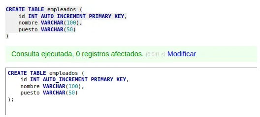
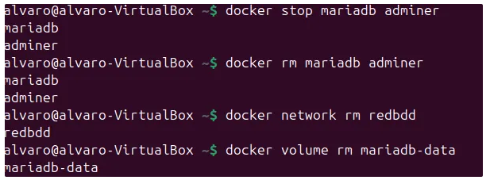

# 🌐 E3 - Contenedores en Red: Adminer y MariaDB

> Álvaro Ronco Acebal y Guillermo Jesús Martín Pérez 

[TOC]

## Introducción

En este ejercicio, se desplegarán dos contenedores en una red Docker:

- Un contenedor con **MariaDB** como servidor de base de datos.
- Un contenedor con **Adminer** (o phpMyAdmin) como interfaz gráfica para gestionar la base de datos.

La clave de este ejercicio es conectar ambos contenedores a través de una red bridge personalizada en Docker.

------

## Crear una red personalizada en Docker

Para que los contenedores puedan comunicarse, creamos una redllamada `redbdd`:

```bash
$docker network create redbdd
```



Para ver los parámetros de la red creada podemos usar el siguiente comando:

```bash
$docker network inspect
```


------

## Crear el contenedor de MariaDB

Ejecutamos un contenedor con la imagen oficial de MariaDB dentro de la red `redbd`:

```bash
$docker run -d --name mariadb --network redbdd -e MYSQL_ROOT_PASSWORD=root -e MYSQL_DATABASE=base -e MYSQL_USER=daw -e MYSQL_PASSWORD=daw -v mariadb-data:/var/lib/mysql mariadb
```

Explicación de los parámetros:

- `-name mariadb` → Nombre del contenedor.

- `-network redbdd` → Conecta el contenedor a la red `redbdd`.

- `e MYSQL_ROOT_PASSWORD=root` → Establece la contraseña del root.

- `e MYSQL_DATABASE=base` → Crea la base de datos `base`.

- `e MYSQL_USER=daw` y `e MYSQL_PASSWORD=daw` → Crea el usuario `daw`.

- `v mariadb-data:/var/lib/mysql` → Utiliza un volumen persistente.

  

------

## Crear el contenedor de Adminer

Adminer es una interfaz web que permite gestionar bases de datos de forma gráfica. Se ejecuta con el siguiente comando:

```bash
$docker run -d --name adminer --network redbdd -p 8080:8080 adminer
```

Explicación de los parámetros:

- `-network redbdd` → Conecta Adminer a la misma red que MariaDB.

- `p 8080:8080` → Expone Adminer en el puerto 8080.

  

Para comprobar que ambos contenedores estan funcionando correctamente podemos usar:

```bash
$docker ps
```



------

## Acceder a Adminer

Para acceder a “adminer” abrimos un navegador y vasmos a la siguiente url:

```
 http://localhost:8080
```



Una vez en la pestaña anterior introducimos las credenciales de acceso creadas al crear el contenedor de mariadb:

- **Servidor**: `mariadb` (el nombre del contenedor)
- **Usuario**: `daw`
- **Contraseña**: `daw`
- **Base de datos**: `base`



------

## Crear una base de datos y una tabla desde Adminer

Dentro de Adminer, crea una nueva tabla con el siguiente SQL:

```sql
CREATE TABLE empleados (
    id INT AUTO_INCREMENT PRIMARY KEY,
    nombre VARCHAR(100),
    puesto VARCHAR(50)
);
```



------

## Eliminar los contenedores, la red y los volúmenes

Cuando terminemos de usar los contenedores, podemos eliminarlos con:

```bash
$docker stop mariadb adminer
$docker rm mariadb adminer
$docker network rm redbdd
$docker volume rm mariadb-data
```

