# E5 - Despliegue de una Aplicación Web con Dockerfile

> Álvaro Ronco Acebal y Guillermo Jesús Martín Pérez

[TOC]

En este ejercicio, crearemos una imagen personalizada basada en PHP 7.4 con Apache, subiremos la imagen a Docker Hub y desplegaremos una aplicación web simple en un contenedor.

## Crear el directorio del proyecto

Para organizar los archivos, creamos una carpeta y dentro de ella los archivos necesarios:

````bash
$mkdir mi-web
$cd mi-web
````

Dentro de esta carpeta se deben incluir:

- Un archivo `index.html` con los nombres de los integrantes del grupo.

- Un archivo `styles.css` con un diseño básico.

- Un archivo `script.php` que ejecutará código en PHP.

- Un `Dockerfile` para la automatización del contenedor.

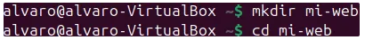

### Crear los archivos del sitio web

Archivo `index.php`:

````php
<!DOCTYPE html>
<html lang="es">
  <head>
    <meta charset="UTF-8" />
    <meta name="viewport" content="width=device-width, initial-scale=1.0" />
    <title>Incluir PHP en HTML</title>
  </head>
  <body>
    <h1>Hola, este es un ejemplo de incluir un archivo PHP</h1>

    <?php
        // Incluir el archivo PHP en el HTML
        include 'script.php';  // O también podrías usar require
    ?>
  </body>
</html>
````

Archivo `styles.css`:

```css
body {
    font-family: Arial, sans-serif;
    background-color: #f4f4f4;
    text-align: center;
}
h1 {
    color: #333;
}
```

Archivo `script.php`:

```php
<?php
 setlocale(LC_TIME, "es_ES.UTF-8");
 $mes_actual = strftime("%B");
 $fecha_actual = date("d/m/Y");
 $hora_actual = date("H:i:s");
 echo "<h1>Información</h1>";
 echo "<p>Hoy es $fecha_actual</p>";
 echo "<p>El mes es: <strong>$mes_actual</strong></p>";
 echo "<p>Hora: $hora_actual</p>";
 ?>
```

Todos creados y editados usando `nano`:

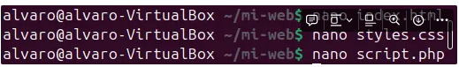

Finalmente creamos el archivo Docker con lo siguiente:

````yaml
# Usar la imagen oficial de PHP con Apache
FROM php:7.4-apache

# Copiar los archivos del sitio web al directorio raíz del servidor
COPY . /var/www/html/

# Exponer el puerto 8000 para acceder a la aplicación
EXPOSE 8000

# Iniciar Apache en segundo plano
CMD ["apache2-foreground"]
````

**Explicación:**

- `FROM php:7.4-apache` → Usa la imagen oficial de PHP con Apache.
- `COPY . /var/www/html/` → Copia los archivos del sitio web al contenedor.
- `EXPOSE 8000` → Indica que el contenedor usará el puerto 8000.
- `CMD ["apache2-foreground"]` → Inicia Apache al arrancar el contenedor.

## **Construir y ejecutar la imagen**

Construir la imagen personalizada, para ello ejecutamos el siguiente comando en la carpeta donde está el `Dockerfile`:

````bash
$docker build -t mi-web .
````

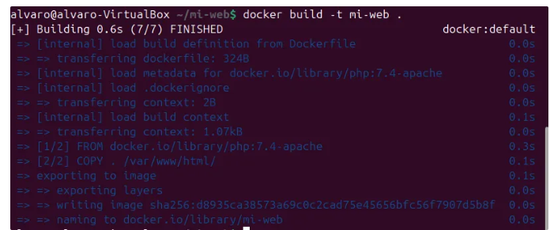

Ejecutar el contenedor:

```bash
$docker run -d -p 8000:80 --name web mi-web
```

**Explicación:**

- `p 8000:80` → Mapea el puerto 80 del contenedor al puerto 8000 del host.
- `-name web` → Nombra el contenedor como `web`.

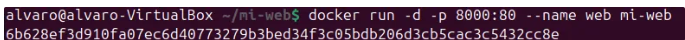

Abre un navegador y accede a http://localhost:8000 para ver la página cargada.

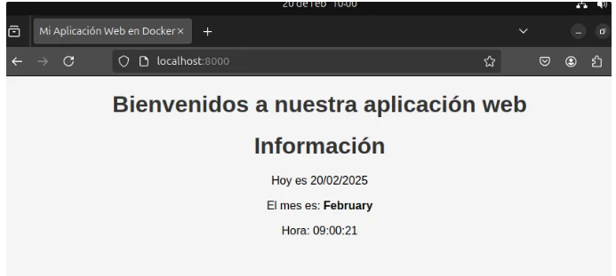

## Subir la imagen a Docker Hub

Para compartir la imagen con el equipo, la subimos a Docker Hub.

1. Iniciar sesión en Docker Hub:

```bash
$docker login
```

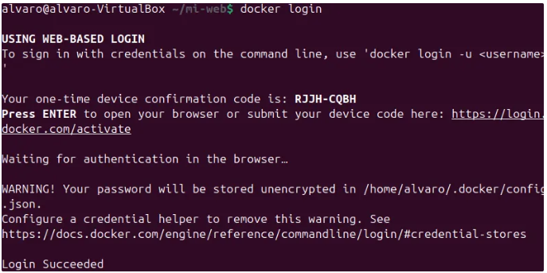

2.  Etiquetar la imagen con el nombre del usuario en Docker Hub y subir la imagen al repositorio:

```bash
$docker tag mi-web alvarora62/mi-web:lastest
$docker push alvarora62/mi-web:lastest
```

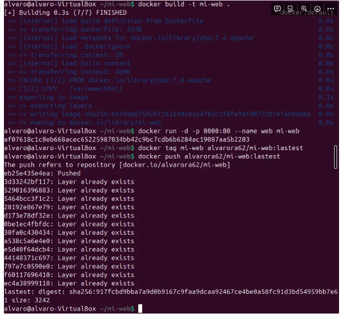

## Descargar la imagen desde otra máquina

Para probar que la imagen se puede compartir, otro integrante del equipo sigue los siguientes pasos:

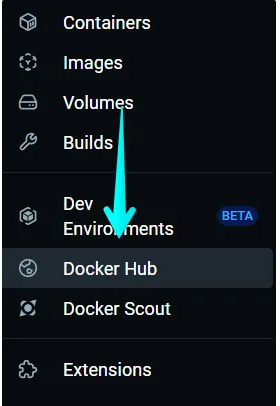


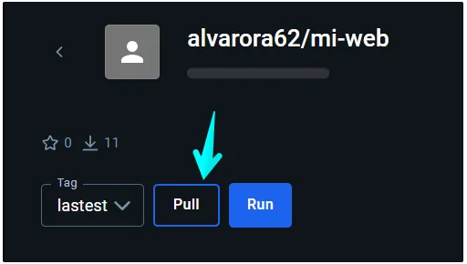

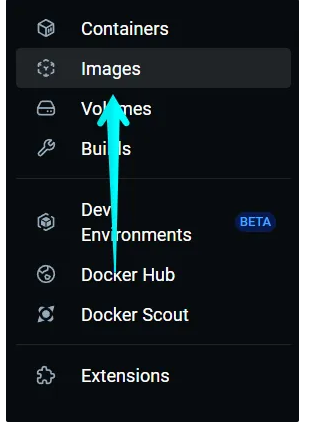

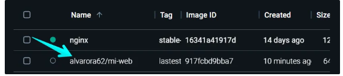

Una vez descargada la imagen pasamos a crear un contenedor.

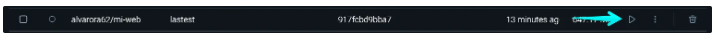

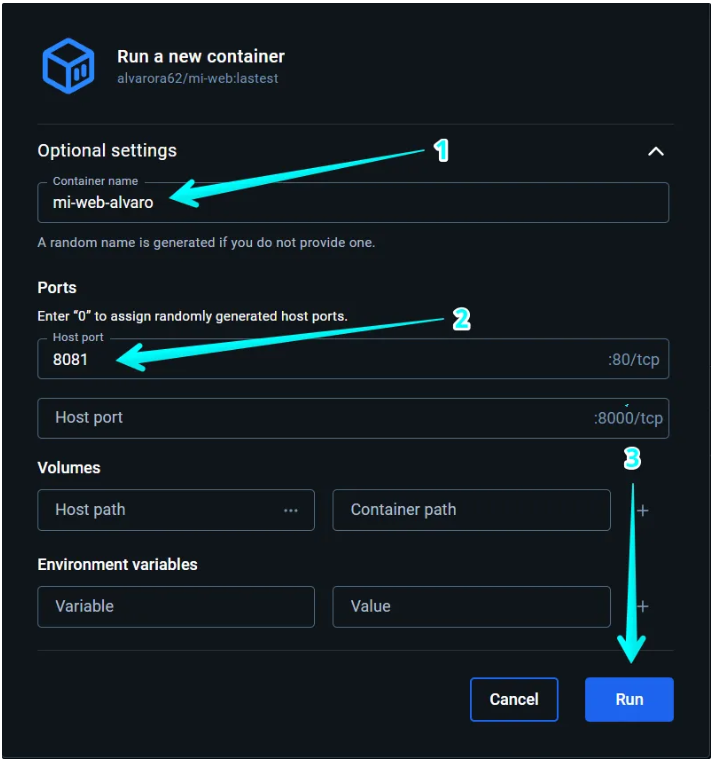

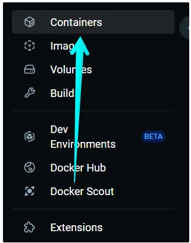

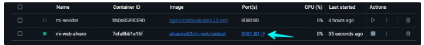

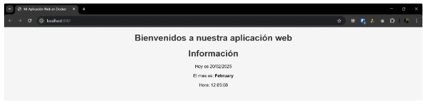

## Eliminar todo

Cuando terminemos, podemos limpiar el sistema:

```bash
$docker stop web
$docker rm web
$docker rmi usuario-dockerhub/mi-web
```

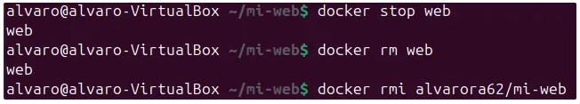